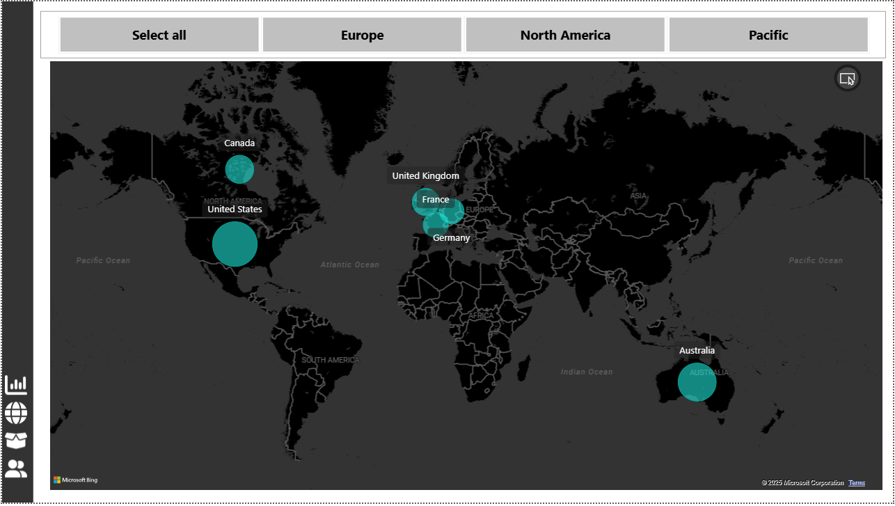

# 🛒 AdventureWorks Power BI Dashboard

This project is a Power BI dashboard created as part of my learning journey in data analytics and business intelligence. The dashboard analyzes a sample retail dataset (*AdventureWorks*) to generate actionable business insights across customers, products, and geographies.

---

## 📌 Key Features

### 📊 Executive Dashboard
- Total Revenue, Profit, and Order KPIs
- Monthly trends for Revenue and Profit
- Slicers for Region, Product Category, Year, and more

### 📍 Map Visualization
- Geo-distribution of Sales using map visuals
- Regional performance and filtering

### 📦 Product Details
- Revenue and Profit by Product Name
- Category-wise performance comparison
- Profitability vs. Quantity sold matrix

### 👥 Customer Details
- Top Customers by Revenue
- Revenue Contribution % per Customer
- Average Sales per Customer
- Dynamic customer filtering

---

## 🧠 Skills Applied

- **Power BI Desktop**
- **Data modeling & relationships**
- **DAX (Data Analysis Expressions)**
- **Custom visuals & formatting**
- **Filters, slicers, and bookmarks**
- **Data storytelling and insight generation**

---

## 🖼️ Screenshots

### Executive Dashboard

### Sales Map

### Product Insights

### Customer Overview

---

## 📁 Files Included

| File | Description |
|------|-------------|
| `AdventureWorks.pbix` | Complete Power BI dashboard file |
| `Exec Dashboard.PNG` | Executive-level summary |
| `Customer Details.PNG` | Customer revenue breakdown |
| `Map.PNG` | Geo-based visualization |
| `Product Details.PNG` | Product profitability analysis |

---

## 🚀 Project Purpose

This project is part of my transition into the data analytics field. I'm currently upskilling in Power BI, Python, and backend development, and building real-world projects to demonstrate practical knowledge and value.

---

## 🔗 Connect with Me

- [LinkedIn]([https://www.linkedin.com])(https://www.linkedin.com/in/vaibhav-vaibhav/)

---

### ⭐ If you like this project, feel free to star the repo or connect with me for collaboration!

